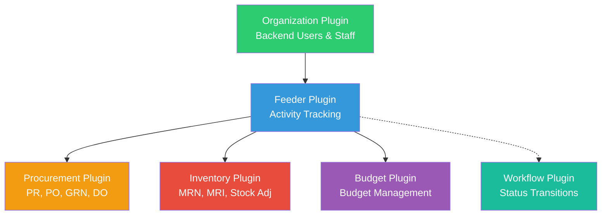
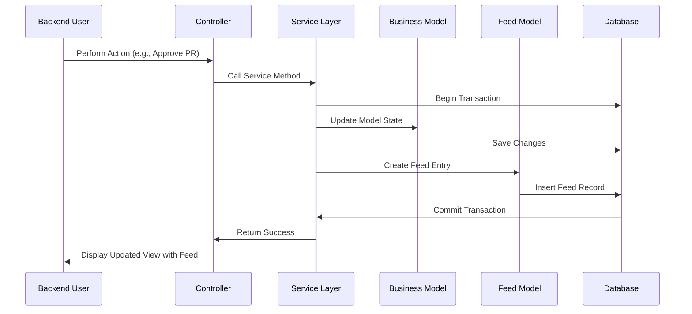
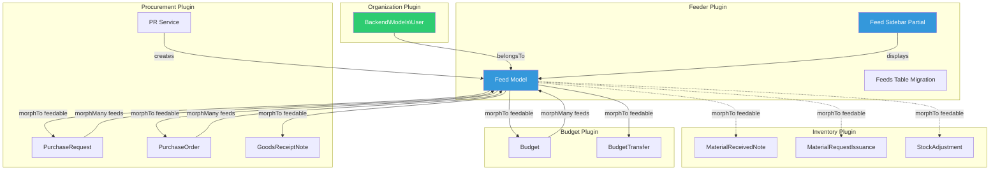

# Integration Guide - Feeder Plugin

## Overview

This document provides a comprehensive guide on how the Feeder plugin integrates with other OMSB plugins and how to implement feed tracking in new plugins.

## Plugin Dependencies

### Direct Dependencies

```yaml
Feeder Plugin Requires:
  - Omsb.Organization (Backend user management)
```

**Reason**: Feeder tracks actions by backend users (staff members), so it needs access to the `Backend\Models\User` model from the Organization plugin.

### Dependent Plugins

The following plugins use the Feeder plugin for activity tracking:

```yaml
Plugins Using Feeder:
  - Omsb.Procurement
  - Omsb.Inventory
  - Omsb.Budget
  - (Potentially) Omsb.Organization
  - (Potentially) Omsb.Workflow
```

## Integration Architecture

### Dependency Graph



### Data Flow Diagram



## Integration Patterns

### Pattern 1: Model-Level Integration (MorphMany Relationship)

Models that need feed tracking define a `morphMany` relationship:

```php
<?php namespace Omsb\Procurement\Models;

use Model;

class PurchaseRequest extends Model
{
    public $morphMany = [
        'feeds' => [
            'Omsb\Feeder\Models\Feed',
            'name' => 'feedable'
        ]
    ];
}
```

**Usage:**
```php
// Get all feeds for a purchase request
$feeds = $purchaseRequest->feeds;

// Get feeds with user eager loaded
$feeds = $purchaseRequest->feeds()->with('user')->get();

// Get recent feeds only
$recentFeeds = $purchaseRequest->feeds()
    ->orderBy('created_at', 'desc')
    ->limit(10)
    ->get();
```

**Benefits:**
- Clean ORM syntax
- Automatic relationship handling
- Can use Eloquent query builder
- Easy to load with parent model

**Location in Code:**
- `/plugins/omsb/procurement/models/PurchaseRequest.php:144-148`
- `/plugins/omsb/budget/models/Budget.php` (similar pattern)
- `/plugins/omsb/budget/models/BudgetTransfer.php` (similar pattern)

### Pattern 2: Direct Feed Creation (Service Layer)

Service classes explicitly create feed entries when performing business operations:

```php
<?php namespace Omsb\Procurement\Services;

use Omsb\Procurement\Models\PurchaseRequest;
use Omsb\Feeder\Models\Feed;
use BackendAuth;
use Db;

class PurchaseRequestService
{
    public function approvePurchaseRequest(PurchaseRequest $pr, string $comments = null): bool
    {
        return Db::transaction(function () use ($pr, $comments) {
            $oldStatus = $pr->status;
            
            // 1. Update the model
            $pr->status = 'approved';
            $pr->approved_by = BackendAuth::getUser()->id;
            $pr->approved_at = now();
            $pr->save();
            
            // 2. Create feed entry
            Feed::create([
                'user_id' => BackendAuth::getUser()->id,
                'action_type' => 'approve',
                'feedable_type' => PurchaseRequest::class,
                'feedable_id' => $pr->id,
                'title' => 'Purchase Request Approved',
                'body' => $comments,
                'additional_data' => [
                    'document_number' => $pr->document_number,
                    'total_amount' => $pr->total_amount,
                    'status_from' => $oldStatus,
                    'status_to' => 'approved',
                ],
            ]);
            
            return true;
        });
    }
}
```

**Benefits:**
- Explicit and clear
- Full control over feed data
- Can include rich metadata
- Transaction-safe (rollback on failure)

**Best Practice:**
Always create feeds inside database transactions to ensure consistency.

### Pattern 3: Static Method for Retrieval

Use the static `getForDocument()` method for convenient feed retrieval:

```php
use Omsb\Feeder\Models\Feed;

// In your controller or service
$feeds = Feed::getForDocument(PurchaseRequest::class, $prId, 50);
```

**Implementation:**
```php
// In Feed model
public static function getForDocument(string $feedableType, int $feedableId, int $limit = 50)
{
    return static::where('feedable_type', $feedableType)
        ->where('feedable_id', $feedableId)
        ->with('user')
        ->orderBy('created_at', 'desc')
        ->limit($limit)
        ->get();
}
```

**Benefits:**
- Consistent query pattern
- Eager loads user relationship
- Optimized for common use case
- Clean API

**Location:** `/plugins/omsb/feeder/models/Feed.php:160-168`

### Pattern 4: UI Integration (Sidebar Partial)

Display feed in backend forms using the reusable partial:

```php
<!-- In controller view (update.php, preview.php) -->
<div class="layout">
    <div class="layout-row">
        <!-- Main content -->
        <div class="layout-cell flex-grow-1">
            <?= $this->formRender() ?>
        </div>
        
        <!-- Sidebar with feed -->
        <div class="layout-cell layout-sidebar" style="width: 350px;">
            <?= $this->makePartial('$/omsb/feeder/partials/_feed_sidebar.htm', [
                'feedableType' => get_class($formModel),
                'feedableId' => $formModel->id,
                'title' => 'Activity Feed',
                'limit' => 50,
            ]) ?>
        </div>
    </div>
</div>
```

**Benefits:**
- Zero-configuration UI component
- Consistent look and feel
- Responsive design
- Timeline view with avatars

**Location:** `/plugins/omsb/feeder/partials/_feed_sidebar.htm`

## Cross-Plugin Integration Map

### Procurement Plugin Integration

**Models Using Feeds:**
- PurchaseRequest
- PurchaseOrder
- VendorQuotation
- GoodsReceiptNote (GRN)
- DeliveryOrder (DO)

**Typical Activities Logged:**
```
PurchaseRequest:
  - create: When PR is created
  - update: When PR details are modified
  - submit: When submitted for approval
  - approve: When approved by manager/department head
  - reject: When rejected
  - cancel: When cancelled

PurchaseOrder:
  - create: When PO is generated from approved PR
  - update: When PO details are modified
  - approve: When PO is approved
  - complete: When all items received

GoodsReceiptNote:
  - create: When goods are received
  - update: When receipt details are modified
  - verify: When receipt is verified by inventory team
  - complete: When goods are moved to warehouse
```

**Integration Point:**
```php
// In PurchaseRequest model
public $morphMany = [
    'feeds' => [
        'Omsb\Feeder\Models\Feed',
        'name' => 'feedable'
    ]
];
```

**File:** `/plugins/omsb/procurement/models/PurchaseRequest.php:144-148`

### Inventory Plugin Integration

**Models with Feed Tracking (Planned/Commented):**
- MaterialReceivedNote (MRN) - Commented out
- MaterialRequestIssuance (MRI) - Commented out
- StockAdjustment - Commented out
- StockTransfer
- PhysicalCount

**Current Status:**
Feed relationships are commented out in the code, indicating planned but not yet active integration.

**Example (Commented Out):**
```php
// In MRN model
public $morphMany = [
    // 'feeds' => [\Omsb\Feeder\Models\Feed::class, 'name' => 'feedable']
];
```

**Files:**
- `/plugins/omsb/inventory/models/Mrn.php`
- `/plugins/omsb/inventory/models/Mri.php`
- `/plugins/omsb/inventory/models/StockAdjustment.php`

**Future Activities to Log:**
```
MRN:
  - create: When goods are received
  - update: When receipt details are updated
  - verify: When verified by supervisor
  - complete: When posted to inventory ledger

MRI:
  - create: When material request is issued
  - approve: When approved by department head
  - complete: When items issued from warehouse

StockAdjustment:
  - create: When adjustment is initiated
  - approve: When approved by warehouse manager
  - complete: When posted to ledger

StockTransfer:
  - create: When transfer is initiated
  - approve: When approved
  - ship: When items shipped from source warehouse
  - receive: When items received at destination warehouse

PhysicalCount:
  - create: When count is initiated
  - update: When count sheets are updated
  - verify: When verified against system QoH
  - complete: When adjustments are posted
```

### Budget Plugin Integration

**Models Using Feeds:**
- Budget
- BudgetTransfer
- BudgetAdjustment
- BudgetReallocation

**Typical Activities Logged:**
```
Budget:
  - create: When budget is created for a period
  - update: When budget allocations are modified
  - approve: When approved by finance
  - lock: When locked for the period

BudgetTransfer:
  - create: When transfer is requested
  - approve: When approved by authorized personnel
  - complete: When transfer is executed

BudgetAdjustment:
  - create: When adjustment is requested
  - review: When reviewed by finance
  - approve: When approved
  - complete: When adjustment is applied

BudgetReallocation:
  - create: When reallocation is initiated
  - approve: When approved
  - complete: When reallocation is executed
```

**Integration Point:**
```php
// In Budget model
public $morphMany = [
    'feeds' => [
        'Omsb\Feeder\Models\Feed',
        'name' => 'feedable'
    ]
];
```

**Files:**
- `/plugins/omsb/budget/models/Budget.php`
- `/plugins/omsb/budget/models/BudgetTransfer.php`
- `/plugins/omsb/budget/models/BudgetAdjustment.php`
- `/plugins/omsb/budget/models/BudgetReallocation.php`

### Workflow Plugin Integration (Potential)

**Integration Opportunity:**
The Workflow plugin could automatically create feed entries when workflow status transitions occur.

**Proposed Implementation:**
```php
// In Workflow event listener
Event::listen('workflow.transition.after', function($instance, $fromStatus, $toStatus) {
    Feed::create([
        'user_id' => BackendAuth::getUser()->id,
        'action_type' => 'status_change',
        'feedable_type' => get_class($instance->workflowable),
        'feedable_id' => $instance->workflowable_id,
        'additional_data' => [
            'workflow_code' => $instance->workflow_code,
            'status_from' => $fromStatus,
            'status_to' => $toStatus,
        ],
    ]);
});
```

**Benefits:**
- Automatic feed creation for all workflow transitions
- Consistent logging across all workflow-enabled models
- Reduced code duplication

**Status:** Not currently implemented, but recommended enhancement.

### Organization Plugin Integration

**Current Relationship:**
- Feeder depends on Organization for backend user management
- Feed model has `belongsTo` relationship with `Backend\Models\User`

**Potential Future Integration:**
Log activities on organizational entities:
```
Company:
  - create: When company is added
  - update: When company details are modified
  - activate/deactivate: When status changes

Site:
  - create: When site is added
  - update: When site details are modified
  - assign_staff: When staff is assigned to site

Staff:
  - create: When staff account is created
  - update: When staff details are modified
  - assign_role: When roles/permissions are changed
  - activate/deactivate: When status changes
```

## Integration Best Practices

### 1. Transaction Safety

Always create feeds inside database transactions:

```php
use Db;

public function performBusinessOperation($model, $data)
{
    return Db::transaction(function () use ($model, $data) {
        // 1. Perform business logic
        $model->update($data);
        
        // 2. Create feed entry
        Feed::create([
            'user_id' => BackendAuth::getUser()->id,
            'action_type' => 'update',
            'feedable_type' => get_class($model),
            'feedable_id' => $model->id,
        ]);
        
        return true;
    });
}
```

**Why:** Ensures feed is only created if the main operation succeeds. If any error occurs, both changes are rolled back.

### 2. Rich Metadata

Store relevant context in `additional_data`:

```php
Feed::create([
    'user_id' => BackendAuth::getUser()->id,
    'action_type' => 'approve',
    'feedable_type' => PurchaseRequest::class,
    'feedable_id' => $pr->id,
    'additional_data' => [
        'document_number' => $pr->document_number,
        'total_amount' => $pr->total_amount,
        'currency' => 'MYR',
        'status_from' => $oldStatus,
        'status_to' => 'approved',
        'approval_level' => 'department_head',
        'comments' => $approvalComments,
    ],
]);
```

**Benefits:**
- Provides complete context for audit trail
- Enables rich display in UI
- Facilitates reporting and analytics

### 3. Consistent Action Types

Use standardized action type names across plugins:

```php
// Standard action types
const ACTION_CREATE = 'create';
const ACTION_UPDATE = 'update';
const ACTION_DELETE = 'delete';
const ACTION_APPROVE = 'approve';
const ACTION_REJECT = 'reject';
const ACTION_SUBMIT = 'submit';
const ACTION_REVIEW = 'review';
const ACTION_COMPLETE = 'complete';
const ACTION_CANCEL = 'cancel';
const ACTION_COMMENT = 'comment';
const ACTION_VERIFY = 'verify';
```

**Why:** Consistent naming enables cross-plugin filtering and reporting.

### 4. User Attribution

Always use `BackendAuth::getUser()->id`:

```php
use BackendAuth;

Feed::create([
    'user_id' => BackendAuth::getUser()->id,
    // ... other fields
]);
```

**Exception:** System-generated actions can have `null` user_id.

### 5. Error Handling

Handle feed creation failures gracefully:

```php
try {
    Feed::create([
        'user_id' => BackendAuth::getUser()->id,
        'action_type' => 'update',
        'feedable_type' => get_class($model),
        'feedable_id' => $model->id,
    ]);
} catch (\Exception $e) {
    // Log error but don't block main operation
    Log::error('Failed to create feed: ' . $e->getMessage());
}
```

**Why:** Feed creation failure should not block critical business operations.

### 6. Polymorphic Naming

Use fully qualified class names for `feedable_type`:

```php
// Correct
'feedable_type' => \Omsb\Procurement\Models\PurchaseRequest::class

// Also correct (using imported class)
use Omsb\Procurement\Models\PurchaseRequest;
'feedable_type' => PurchaseRequest::class

// Incorrect (short name)
'feedable_type' => 'PurchaseRequest'
```

**Why:** Prevents naming conflicts and ensures proper relationship loading.

## Integration Checklist

When adding feed tracking to a new plugin:

- [ ] Add `morphMany` relationship to your model
- [ ] Create feed entries in service layer methods
- [ ] Use database transactions for consistency
- [ ] Store rich metadata in `additional_data`
- [ ] Use standardized action type names
- [ ] Add sidebar partial to relevant backend views
- [ ] Test feed creation in all scenarios
- [ ] Document feed integration in plugin README
- [ ] Add tests for feed creation logic
- [ ] Consider permission-based access to feeds

## Common Integration Scenarios

### Scenario 1: New Document Creation

```php
public function createDocument(array $data): Model
{
    return Db::transaction(function () use ($data) {
        $document = Document::create($data);
        
        Feed::create([
            'user_id' => BackendAuth::getUser()->id,
            'action_type' => 'create',
            'feedable_type' => Document::class,
            'feedable_id' => $document->id,
            'additional_data' => [
                'document_number' => $document->document_number,
            ],
        ]);
        
        return $document;
    });
}
```

### Scenario 2: Status Transition

```php
public function changeStatus(Model $model, string $newStatus): bool
{
    return Db::transaction(function () use ($model, $newStatus) {
        $oldStatus = $model->status;
        $model->status = $newStatus;
        $model->save();
        
        Feed::create([
            'user_id' => BackendAuth::getUser()->id,
            'action_type' => 'status_change',
            'feedable_type' => get_class($model),
            'feedable_id' => $model->id,
            'additional_data' => [
                'status_from' => $oldStatus,
                'status_to' => $newStatus,
            ],
        ]);
        
        return true;
    });
}
```

### Scenario 3: User Comment

```php
public function addComment(Model $model, string $title, string $body): void
{
    Feed::create([
        'user_id' => BackendAuth::getUser()->id,
        'action_type' => 'comment',
        'feedable_type' => get_class($model),
        'feedable_id' => $model->id,
        'title' => $title,
        'body' => $body,
    ]);
}
```

### Scenario 4: Bulk Operations

```php
public function bulkApprove(array $documentIds): int
{
    $count = 0;
    
    Db::transaction(function () use ($documentIds, &$count) {
        foreach ($documentIds as $id) {
            $document = Document::find($id);
            if ($document && $document->canApprove()) {
                $oldStatus = $document->status;
                $document->status = 'approved';
                $document->save();
                
                Feed::create([
                    'user_id' => BackendAuth::getUser()->id,
                    'action_type' => 'approve',
                    'feedable_type' => Document::class,
                    'feedable_id' => $document->id,
                    'additional_data' => [
                        'bulk_operation' => true,
                        'status_from' => $oldStatus,
                        'status_to' => 'approved',
                    ],
                ]);
                
                $count++;
            }
        }
    });
    
    return $count;
}
```

## Integration Diagram (Detailed)



## Conclusion

The Feeder plugin provides a flexible, robust foundation for activity tracking across the OMSB ERP system. By following the integration patterns and best practices outlined in this document, plugins can easily implement comprehensive audit trails with minimal code duplication.

**Key Takeaways:**
1. Use `morphMany` relationship in your models
2. Create feeds in service layer with transactions
3. Store rich metadata for context
4. Use standardized action types
5. Display feeds with the reusable sidebar partial
6. Handle errors gracefully

---

**Previous:** [← Index](00_index.md) | **Next:** [Components Guide →](02_components.md)
